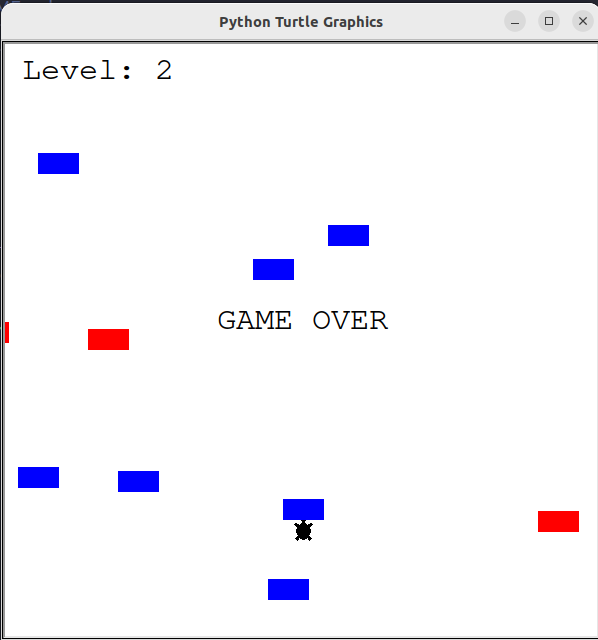

# Turtle Crossing Car Game

## About
This project is a Mini-Game in Python, following OOP and using the Turtle module. The goal of this game is to help a turtle to cross the street.

## 📝 Game instructions:
Use the arrow up key to move the turtle to the other side of the street without getting hit by a car.
Be careful as the cars will be moving faster, each time you level up.

## 🛠 Built With:
• [python](https://www.python.org/downloads)

## ⚙️ Dependencies:
+ Python v3.x is required.
+ A turtle module is also required.

## 📺 Demo:
